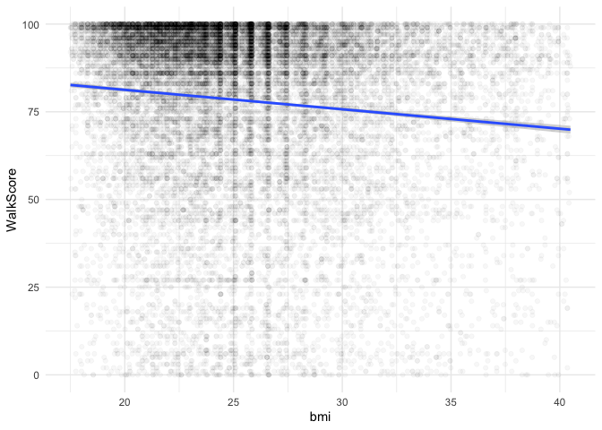
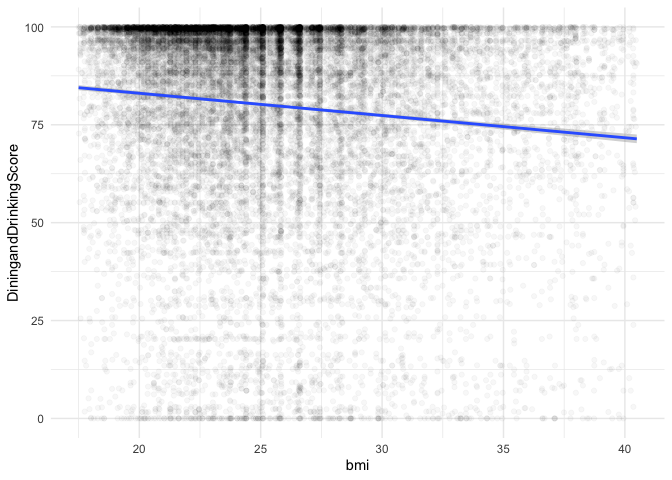
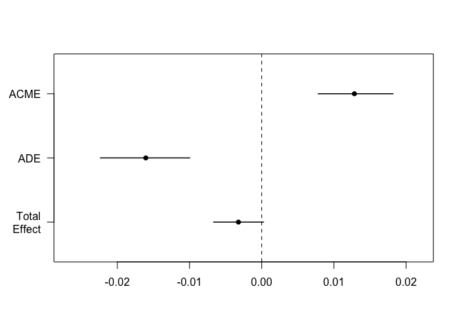

This Rmd file will be used as the file for my Thesis Analysis on causal mediation.

# Libraries

```r
library(tidyverse)
library(car)
library(foreign)
library(Hmisc)
library(knitr)
library(dplyr)
library(survival)
library(finalfit)
library(tableone)
library(lme4)
library(e1071)
library(mediation)
library(broom)
```

# Reading of Raw Survey Data

```r
ibiccs_readin <- read.csv("/Volumes/hkr-storage/Research/dfuller/Walkabilly/data/IBICCS/Complete/Database_recoded_2012-2014_weights_Walkscore_RTA.csv")

write.csv(ibiccs_readin, "/Users/dfuller/Desktop/ibiccs.csv")

setwd("/Users/dfuller/Dropbox/Students/MUN/Kassia Orychock/Thesis")

ibiccs_readin$TransitScore <- as.numeric(ibiccs_readin$TransitScore)
ibiccs_readin$BikeScore <- as.numeric(ibiccs_readin$BikeScore)
```

# Recode BMI

```r
## BMI
ibiccs_clean <- ibiccs_readin %>%
	mutate(bmi_category = case_when(
		bmi < 18.5 ~ "underweight",
		bmi >=30 & bmi <999 ~ "obese",
		bmi >=25 & bmi <30 ~ "overweight",
		bmi >=18.5 & bmi <25 ~ "normal weight",
		bmi == 9999 ~ "NA",
		TRUE ~ "other"
	))

table(ibiccs_clean$bmi_category)
```

```
## 
## normal weight         obese         other    overweight   underweight 
##         10437          3672          2741          6658           393
```

```r
summary(ibiccs_clean$bmi)
```

```
##    Min. 1st Qu.  Median    Mean 3rd Qu.    Max.    NA's 
##    17.5    22.1    24.9    25.6    28.2    40.5    2741
```

# Recode Language

```r
table(ibiccs_clean$lang)
```

```
## 
##  Anglais Espagnol Français 
##    22236       44     1621
```

```r
## Language
ibiccs_clean <- ibiccs_clean %>%
	mutate(language = case_when(
		lang == "Anglais" ~ "English",
		lang == "Espagnol" ~ "Fren/Span",
		lang == "Français" ~ "Fren/Span"
	))
table(ibiccs_clean$lang, ibiccs_clean$language)
```

```
##           
##            English Fren/Span
##   Anglais    22236         0
##   Espagnol       0        44
##   Français       0      1621
```

# Recode Gender

```r
table(ibiccs_clean$q54)
```

```
## 
## Femme Homme 
## 14042  9859
```

```r
#Gender
ibiccs_clean <- ibiccs_clean %>%
  mutate(gender = case_when(
    q54 == "Femme" ~ "Female",
    q54 == "Homme" ~ "Male"
  ))
table(ibiccs_clean$q54, ibiccs_clean$gender)
```

```
##        
##         Female  Male
##   Femme  14042     0
##   Homme      0  9859
```

# Recode Self-Rated Health

```r
table(ibiccs_clean$q2)
```

```
## 
##                            Bon                      Excellent 
##                           6725                           4803 
##                        Mauvais                          Moyen 
##                            489                           2104 
## Ne sais pas/Refuse de répondre                       Très bon 
##                             39                           9741
```

```r
ibiccs_clean <- ibiccs_clean %>%
  mutate(health = case_when(
    q2 == "Excellent" ~ "Excellent",
    q2 == "Très bon" ~ "Very Good",
    q2 == "Bon" ~ "Good",
    q2 == "Moyen" ~ "Poor/Fair",
    q2 == "Mauvais" ~ "Poor/Fair"
  ))
table(ibiccs_clean$q2, ibiccs_clean$health)
```

```
##                                 
##                                  Excellent Good Poor/Fair Very Good
##   Bon                                    0 6725         0         0
##   Excellent                           4803    0         0         0
##   Mauvais                                0    0       489         0
##   Moyen                                  0    0      2104         0
##   Ne sais pas/Refuse de répondre         0    0         0         0
##   Très bon                               0    0         0      9741
```

# Recode Transportation

```r
table(ibiccs_clean$q13)
```

```
## 
##                               Autre (précisez:) 
##                                              35 
##                                          Marche 
##                                            4484 
##                               Ne s'applique pas 
##                                              61 
##                                     Ne sais pas 
##                                              36 
##                                         Scooter 
##                                              21 
##                                            Taxi 
##                                             205 
##                             Transport en commun 
##                                            7886 
## Véhicule motorisé (loué, emprunté, covoiturage) 
##                                            9768 
##                           Vélo en libre-service 
##                                             243 
##                                  Vélo personnel 
##                                             934 
##                             Voiture personnelle 
##                                             228
```

```r
ibiccs_clean <- ibiccs_clean %>%
  mutate(common_transportation = case_when(
    q13 == "Marche" ~ "Walking",
    q13 == "Véhicule motorisé (loué, emprunté, covoiturage)" ~ "Car",
    q13 == "Voiture personnelle" ~ "Car",
    q13 == "Scooter" ~ "Other",
    q13 == "Taxi" ~ "Other",
    q13 == "Autre (précisez:)" ~ "Bicycle/Other",
    q13 == "Transport en commun" ~ "Public Transportation",
    q13 == "Vélo en libre-service" ~ "Bicycle/Other",
    q13 == "Vélo personnel" ~ "Bicycle/Other"
  ))
table(ibiccs_clean$q13, ibiccs_clean$common_transportation)
```

```
##                                                  
##                                                   Bicycle/Other  Car Other
##   Autre (précisez:)                                          35    0     0
##   Marche                                                      0    0     0
##   Ne s'applique pas                                           0    0     0
##   Ne sais pas                                                 0    0     0
##   Scooter                                                     0    0    21
##   Taxi                                                        0    0   205
##   Transport en commun                                         0    0     0
##   Véhicule motorisé (loué, emprunté, covoiturage)             0 9768     0
##   Vélo en libre-service                                     243    0     0
##   Vélo personnel                                            934    0     0
##   Voiture personnelle                                         0  228     0
##                                                  
##                                                   Public Transportation Walking
##   Autre (précisez:)                                                   0       0
##   Marche                                                              0    4484
##   Ne s'applique pas                                                   0       0
##   Ne sais pas                                                         0       0
##   Scooter                                                             0       0
##   Taxi                                                                0       0
##   Transport en commun                                              7886       0
##   Véhicule motorisé (loué, emprunté, covoiturage)                     0       0
##   Vélo en libre-service                                               0       0
##   Vélo personnel                                                      0       0
##   Voiture personnelle                                                 0       0
```

# Recode Physically Active (Y/N)

```r
table(ibiccs_clean$q14)
```

```
## 
## Ne sais pas/Ne s'applique pas                           Non 
##                           276                          4124 
##                           Oui            Refuse de répondre 
##                         19471                            30
```

```r
ibiccs_clean <- ibiccs_clean %>%
  mutate(physically_active = case_when(
    q14 == "Oui" ~ "Yes",
    q14 == "Non" ~ "No"
  ))
table(ibiccs_clean$q14, ibiccs_clean$physically_active)
```

```
##                                
##                                    No   Yes
##   Ne sais pas/Ne s'applique pas     0     0
##   Non                            4124     0
##   Oui                               0 19471
##   Refuse de répondre                0     0
```

# Recode Type of Physical Activity 

```r
summary(ibiccs_clean$Tot_Q16_N_times_per_month_phys_activity)
```

```
##    Min. 1st Qu.  Median    Mean 3rd Qu.    Max.    NA's 
##       1       8      12      16      20     120    5078
```

```r
ibiccs_clean <- ibiccs_clean %>% replace_na(list(Tot_Q16_N_times_per_month_phys_activity = 0, 
                       Tot_Q17_N_min_took_part_phys_activity = 0,
                       Tot_Q19_N_times_per_month_phys_activity_most_exercise = 0,
                       Tot_Q20_N_min_took_part_phys_activity_most_exercise = 0))

summary(ibiccs_clean$Tot_Q16_N_times_per_month_phys_activity)
```

```
##    Min. 1st Qu.  Median    Mean 3rd Qu.    Max. 
##     0.0     4.0    12.0    12.7    20.0   120.0
```

```r
ibiccs_clean <- ibiccs_clean %>%
  mutate(
    pa_minutes_week1 = (Tot_Q16_N_times_per_month_phys_activity*Tot_Q17_N_min_took_part_phys_activity)/4,
    pa_minutes_week2 = (Tot_Q19_N_times_per_month_phys_activity_most_exercise*Tot_Q20_N_min_took_part_phys_activity_most_exercise)/4,
    pa_minutes_week = pa_minutes_week1+pa_minutes_week2
  )

summary(ibiccs_clean$pa_minutes_week)
```

```
##    Min. 1st Qu.  Median    Mean 3rd Qu.    Max. 
##       0      60     240     509     480   63840
```

```r
pa_histo <- ggplot(ibiccs_clean, aes(pa_minutes_week)) + 
              geom_histogram()
plot(pa_histo)
```

```
## `stat_bin()` using `bins = 30`. Pick better value with `binwidth`.
```

<!-- -->

```r
ibiccs_clean <- ibiccs_clean %>%
  mutate(pa_guidelines = case_when(
    pa_minutes_week <= 149 ~ "no",
    pa_minutes_week > 149 ~ "yes",
  ))

table(ibiccs_clean$pa_guidelines)
```

```
## 
##    no   yes 
##  8409 15492
```

# Recode Days Per Week Spent Travelling via Car

```r
table(ibiccs_clean$q21)
```

```
## 
##    0    1    2    3    4    5    6    7   98   99 
## 2785 2527 2631 2070 1648 3136 2019 4925 2037  123
```

```r
ibiccs_clean <- ibiccs_clean %>%
  mutate(day_per_week_motor_vehicle = case_when(
    q21 == 0 ~ 0,
    q21 == 1 ~ 1,
    q21 == 2 ~ 2,
    q21 == 3 ~ 3,
    q21 == 4 ~ 4,
    q21 == 5 ~ 5,
    q21 == 6 ~ 6,
    q21 == 7 ~ 7,
    q21 == 98 ~ NA_real_,
    q21 == 99 ~ NA_real_
  ))
table(ibiccs_clean$day_per_week_motor_vehicle)
```

```
## 
##    0    1    2    3    4    5    6    7 
## 2785 2527 2631 2070 1648 3136 2019 4925
```

# Recode Days Per Week Spent Travelling via Public Transport

```r
table(ibiccs_clean$q23)
```

```
## 
##    0    1    2    3    4    5    6    7    8    9 
## 6169 2993 2167 1598 1339 3617 1482 1583 2726  227
```

```r
ibiccs_clean <- ibiccs_clean %>%
  mutate(day_per_week_public_transit = case_when(
    q23 == 0 ~ 0,
    q23 == 1 ~ 1,
    q23 == 2 ~ 2,
    q23 == 3 ~ 3,
    q23 == 4 ~ 4,
    q23 == 5 ~ 5,
    q23 == 6 ~ 6,
    q23 == 7 ~ 7,
    q23 == 8 ~ NA_real_,
    q23 == 9 ~ NA_real_
  ))

table(ibiccs_clean$q23, ibiccs_clean$day_per_week_public_transit)
```

```
##    
##        0    1    2    3    4    5    6    7
##   0 6169    0    0    0    0    0    0    0
##   1    0 2993    0    0    0    0    0    0
##   2    0    0 2167    0    0    0    0    0
##   3    0    0    0 1598    0    0    0    0
##   4    0    0    0    0 1339    0    0    0
##   5    0    0    0    0    0 3617    0    0
##   6    0    0    0    0    0    0 1482    0
##   7    0    0    0    0    0    0    0 1583
##   8    0    0    0    0    0    0    0    0
##   9    0    0    0    0    0    0    0    0
```

# Recode Days Per Week Spent Travelling via Walking

```r
table(ibiccs_clean$q25)
```

```
## 
##    0    1    2    3    4    5    6    7    8    9 
## 2115 1841 2361 2245 1831 3994 1711 5436 2149  218
```

```r
ibiccs_clean <- ibiccs_clean %>%
  mutate(day_per_week_walking = case_when(
    q25 == 0 ~ 0,
    q25 == 1 ~ 1,
    q25 == 2 ~ 2,
    q25 == 3 ~ 3,
    q25 == 4 ~ 4,
    q25 == 5 ~ 5,
    q25 == 6 ~ 6,
    q25 == 7 ~ 7,
    q25 == 8 ~ NA_real_,
    q25 == 9 ~ NA_real_
  ))

table(ibiccs_clean$q25, ibiccs_clean$day_per_week_walking)
```

```
##    
##        0    1    2    3    4    5    6    7
##   0 2115    0    0    0    0    0    0    0
##   1    0 1841    0    0    0    0    0    0
##   2    0    0 2361    0    0    0    0    0
##   3    0    0    0 2245    0    0    0    0
##   4    0    0    0    0 1831    0    0    0
##   5    0    0    0    0    0 3994    0    0
##   6    0    0    0    0    0    0 1711    0
##   7    0    0    0    0    0    0    0 5436
##   8    0    0    0    0    0    0    0    0
##   9    0    0    0    0    0    0    0    0
```

# Recode Days Per Week Spent Travelling via Bike

```r
table(ibiccs_clean$q27)
```

```
## 
##     0     1     2     3     4     5     6     7    98    99 
## 12010  1793  1185   741   462   632   215   294  6395   174
```

```r
ibiccs_clean <- ibiccs_clean %>%
  mutate(day_per_week_bike = case_when(
    q27 == 0 ~ 0,
    q27 == 1 ~ 1,
    q27 == 2 ~ 2,
    q27 == 3 ~ 3,
    q27 == 4 ~ 4,
    q27 == 5 ~ 5,
    q27 == 6 ~ 6,
    q27 == 7 ~ 7,
    q27 == 98 ~ NA_real_,
    q27 == 99 ~ NA_real_
  ))

table(ibiccs_clean$q27, ibiccs_clean$day_per_week_bike)
```

```
##     
##          0     1     2     3     4     5     6     7
##   0  12010     0     0     0     0     0     0     0
##   1      0  1793     0     0     0     0     0     0
##   2      0     0  1185     0     0     0     0     0
##   3      0     0     0   741     0     0     0     0
##   4      0     0     0     0   462     0     0     0
##   5      0     0     0     0     0   632     0     0
##   6      0     0     0     0     0     0   215     0
##   7      0     0     0     0     0     0     0   294
##   98     0     0     0     0     0     0     0     0
##   99     0     0     0     0     0     0     0     0
```

# Recode Age

```r
summary(ibiccs_clean$q42)
```

```
##    Min. 1st Qu.  Median    Mean 3rd Qu.    Max. 
##    18.0    31.0    41.0    42.6    53.0    94.0
```

```r
#CCHS/STATCAN or continuous
```

# Recode Marital Status

```r
table(ibiccs_clean$q44)
```

```
## 
##               Célibatiare               Divorcé (e)                 En couple 
##                      9452                      1854                        79 
## Marié(e)/Conjoint de fait        Refuse de répondre                Séparé (e) 
##                     11287                       291                       460 
##                 Veuf (ve) 
##                       478
```

```r
ibiccs_clean <- ibiccs_clean %>%
  mutate(marital_status = case_when(
    q44 == "Célibatiare" ~ "Single",
    q44 == "Divorcé(e)" ~ "Divorced/Separated/Widowed",
    q44 == "En couple" ~ "Relationship/Married/Common-Law",
    q44 == "Marié(e)/Conjoint de fait" ~ "Relationship/Married/Common-Law",
    q44 == "Séparé(e)" ~ "Divorced/Separated/Widowed",
    q44 == "Veuf(ve)" ~ "Divorced/Separated/Widowed"
  ))
table(ibiccs_clean$q44, ibiccs_clean$marital_status)
```

```
##                            
##                             Relationship/Married/Common-Law Single
##   Célibatiare                                             0   9452
##   Divorcé (e)                                             0      0
##   En couple                                              79      0
##   Marié(e)/Conjoint de fait                           11287      0
##   Refuse de répondre                                      0      0
##   Séparé (e)                                              0      0
##   Veuf (ve)                                               0      0
```

# Recode Number of Children in Home

```r
table(ibiccs_clean$q45)
```

```
## 
##     1     2     3     4     5     6     7     8     9 
##  2915  1863   471   119    40    18     9 18191   275
```

```r
ibiccs_clean <- ibiccs_clean %>%
  mutate(children_household = case_when(
    q45 == 1 ~ "1",
    q45 == 2 ~ "2",
    q45 == 3 ~ "3",
    q45 == 4 ~ "3",
    q45 == 5 ~ "3",
    q45 == 6 ~ "3",
    q45 == 7 ~ "3",
    q45 == 8 ~ "none",
    q45 == 9 ~ "none"
  ))
table(ibiccs_clean$q45, ibiccs_clean$children_household)
```

```
##    
##         1     2     3  none
##   1  2915     0     0     0
##   2     0  1863     0     0
##   3     0     0   471     0
##   4     0     0   119     0
##   5     0     0    40     0
##   6     0     0    18     0
##   7     0     0     9     0
##   8     0     0     0 18191
##   9     0     0     0   275
```

# Recode Ethnicity

```r
table(ibiccs_clean$q47)
```

```
## 
## Amérindien des États-Unis / Autochtone d'Amérique 
##                                                79 
##             Arabe (Moyen-Orient, Afrique du Nord) 
##                                               135 
##                Asiatique / insulaire du Pacifique 
##                                              2661 
##                                             Autre 
##                                               129 
##                            Blanc(che) / Caucasien 
##                                             17154 
##                 Hispanique / Latino / Espagnol(e) 
##                                               933 
##                              Indien / Pakistanais 
##                                               330 
##                        Je préfère ne pas répondre 
##                                               639 
##                                            Jewish 
##                                                16 
##                    Mixed / Mixed race / Bi-racial 
##                                               171 
##         Noir(e) / Africain(e) / Afro-Américain(e) 
##                                              1654
```

```r
ibiccs_clean <- ibiccs_clean %>%
  mutate(ethnicity = case_when(
    q47 == "Amérindien des États-Unis / Autochtone d'Amérique" ~ "Other",
    q47 == "Arabe (Moyen-Orient, Afrique du Nord)" ~ "Other",
    q47 == "Asiatique / insulaire du Pacifique" ~ "Asian",
    q47 == "Autre" ~ "Other",
    q47 == "Blanc(che) / Caucasien" ~ "Caucasian",
    q47 == "Hispanique / Latino / Espagnol(e)" ~ "Hispanic",
    q47 == "Indien / Pakistanais" ~ "Other",
    q47 == "Jewish" ~ "Other",
    q47 == "Mixed / Mixed race / Bi-racial" ~ "Other",
    q47 == "Noir(e) / Africain(e) / Afro-Américain(e)" ~ "African American/Canadian"
  ))
table(ibiccs_clean$q47, ibiccs_clean$ethnicity)
```

```
##                                                    
##                                                     African American/Canadian
##   Amérindien des États-Unis / Autochtone d'Amérique                         0
##   Arabe (Moyen-Orient, Afrique du Nord)                                     0
##   Asiatique / insulaire du Pacifique                                        0
##   Autre                                                                     0
##   Blanc(che) / Caucasien                                                    0
##   Hispanique / Latino / Espagnol(e)                                         0
##   Indien / Pakistanais                                                      0
##   Je préfère ne pas répondre                                                0
##   Jewish                                                                    0
##   Mixed / Mixed race / Bi-racial                                            0
##   Noir(e) / Africain(e) / Afro-Américain(e)                              1654
##                                                    
##                                                     Asian Caucasian Hispanic
##   Amérindien des États-Unis / Autochtone d'Amérique     0         0        0
##   Arabe (Moyen-Orient, Afrique du Nord)                 0         0        0
##   Asiatique / insulaire du Pacifique                 2661         0        0
##   Autre                                                 0         0        0
##   Blanc(che) / Caucasien                                0     17154        0
##   Hispanique / Latino / Espagnol(e)                     0         0      933
##   Indien / Pakistanais                                  0         0        0
##   Je préfère ne pas répondre                            0         0        0
##   Jewish                                                0         0        0
##   Mixed / Mixed race / Bi-racial                        0         0        0
##   Noir(e) / Africain(e) / Afro-Américain(e)             0         0        0
##                                                    
##                                                     Other
##   Amérindien des États-Unis / Autochtone d'Amérique    79
##   Arabe (Moyen-Orient, Afrique du Nord)               135
##   Asiatique / insulaire du Pacifique                    0
##   Autre                                               129
##   Blanc(che) / Caucasien                                0
##   Hispanique / Latino / Espagnol(e)                     0
##   Indien / Pakistanais                                330
##   Je préfère ne pas répondre                            0
##   Jewish                                               16
##   Mixed / Mixed race / Bi-racial                      171
##   Noir(e) / Africain(e) / Afro-Américain(e)             0
```

# Recode Country Born

```r
table(ibiccs_clean$q48)
```

```
## 
##     1     2     3     4     5     6     7     8     9    10    11    12    13 
##  7171 13175   246    11    11    20    29    49    20    28    14    17    15 
##    14    15    16    17    18    19    20    21    22    23    24    25    26 
##    12   109   153   104   231   166    39     7    22    77    43    73    28 
##    27    28    29    30    31    32    33    34    35    36    37    38    39 
##    21    57    27    18    93    63    44    48    66    33    33    23    25 
##    40    41    42    43    44    45    46    47    48    49    50    51    52 
##    24   159    51    27    43     8    15     4    40     5    26    14    11 
##    53    54    55    56    57    58    59    60    61    62    63    64    65 
##    20    11    13    34     3    18    13    13    12     9    33    24    13 
##    66    67    68    69    70    71    72    73    74    75    76    77    78 
##    15    20     9     6    13    10     3    16     8     4     5    19    12 
##    79    80    81    96    99 
##     6     9    13   196   473
```

```r
ibiccs_clean <- ibiccs_clean %>%
  mutate(country_born = case_when(
    q48 == 1 ~ "Canada",
    q48 == 2 ~ "United States",
    q48 >= 3 ~ "Other", 
    q48 <= 81 ~ "Other",
    q48 == 96 ~ "Other"
  ))
table(ibiccs_clean$q48, ibiccs_clean$country_born)
```

```
##     
##      Canada Other United States
##   1    7171     0             0
##   2       0     0         13175
##   3       0   246             0
##   4       0    11             0
##   5       0    11             0
##   6       0    20             0
##   7       0    29             0
##   8       0    49             0
##   9       0    20             0
##   10      0    28             0
##   11      0    14             0
##   12      0    17             0
##   13      0    15             0
##   14      0    12             0
##   15      0   109             0
##   16      0   153             0
##   17      0   104             0
##   18      0   231             0
##   19      0   166             0
##   20      0    39             0
##   21      0     7             0
##   22      0    22             0
##   23      0    77             0
##   24      0    43             0
##   25      0    73             0
##   26      0    28             0
##   27      0    21             0
##   28      0    57             0
##   29      0    27             0
##   30      0    18             0
##   31      0    93             0
##   32      0    63             0
##   33      0    44             0
##   34      0    48             0
##   35      0    66             0
##   36      0    33             0
##   37      0    33             0
##   38      0    23             0
##   39      0    25             0
##   40      0    24             0
##   41      0   159             0
##   42      0    51             0
##   43      0    27             0
##   44      0    43             0
##   45      0     8             0
##   46      0    15             0
##   47      0     4             0
##   48      0    40             0
##   49      0     5             0
##   50      0    26             0
##   51      0    14             0
##   52      0    11             0
##   53      0    20             0
##   54      0    11             0
##   55      0    13             0
##   56      0    34             0
##   57      0     3             0
##   58      0    18             0
##   59      0    13             0
##   60      0    13             0
##   61      0    12             0
##   62      0     9             0
##   63      0    33             0
##   64      0    24             0
##   65      0    13             0
##   66      0    15             0
##   67      0    20             0
##   68      0     9             0
##   69      0     6             0
##   70      0    13             0
##   71      0    10             0
##   72      0     3             0
##   73      0    16             0
##   74      0     8             0
##   75      0     4             0
##   76      0     5             0
##   77      0    19             0
##   78      0    12             0
##   79      0     6             0
##   80      0     9             0
##   81      0    13             0
##   96      0   196             0
##   99      0   473             0
```

# Recode Motor Vehicle Access

```r
table(ibiccs_clean$q50)
```

```
## 
## Ne sais pas/Ne s'applique pas                           Non 
##                           230                          6295 
##                           Oui 
##                         17376
```

```r
ibiccs_clean <- ibiccs_clean %>%
  mutate(motor_vehicle_access = case_when(
    q50 == "Non" ~ "No",
    q50 == "Oui" ~ "Yes"
  ))
table(ibiccs_clean$q50, ibiccs_clean$motor_vehicle_access)
```

```
##                                
##                                    No   Yes
##   Ne sais pas/Ne s'applique pas     0     0
##   Non                            6295     0
##   Oui                               0 17376
```

# Recode Education Level

```r
table(ibiccs_clean$q51)
```

```
## 
##                  Aucun grade, certificat ou diplôme 
##                                                  32 
##                                   Autre (précisez): 
##                                                  81 
##                                        Baccalauréat 
##                                                8638 
##                                               Cégep 
##                                                3197 
## Certificat d'école de métier, certificat ou diplôme 
##                                                2559 
##         Diplôme d'études secondaire ou l'équivalent 
##                                                2471 
##     Diplôme universitaire supérieur au baccalauréat 
##                                                6655 
##                                      École primaire 
##                                                  88 
##                                  Refuse de répondre 
##                                                 180
```

```r
ibiccs_clean <- ibiccs_clean %>%
  mutate(education = case_when(
    q51 == "Aucun grade, certificat ou diplôme" ~ "High School/Lower",
    q51 == "Baccalauréat" ~ "Baccalaureate",
    q51 == "Cégep" ~ "Cégep",
    q51 == "Certificat d'école de métier, certificat ou diplôme" ~ "Certificate/Diploma",
    q51 == "Diplôme d'études secondaire ou l'équivalent" ~ "High School/Lower",
    q51 == "Diplôme universitaire supérieur au baccalauréat" ~ "Graduate School",
    q51 == "École primaire" ~ "High School/Lower"
  ))
table(ibiccs_clean$q51, ibiccs_clean$education)
```

```
##                                                      
##                                                       Baccalaureate Cégep
##   Aucun grade, certificat ou diplôme                              0     0
##   Autre (précisez):                                               0     0
##   Baccalauréat                                                 8638     0
##   Cégep                                                           0  3197
##   Certificat d'école de métier, certificat ou diplôme             0     0
##   Diplôme d'études secondaire ou l'équivalent                     0     0
##   Diplôme universitaire supérieur au baccalauréat                 0     0
##   École primaire                                                  0     0
##   Refuse de répondre                                              0     0
##                                                      
##                                                       Certificate/Diploma
##   Aucun grade, certificat ou diplôme                                    0
##   Autre (précisez):                                                     0
##   Baccalauréat                                                          0
##   Cégep                                                                 0
##   Certificat d'école de métier, certificat ou diplôme                2559
##   Diplôme d'études secondaire ou l'équivalent                           0
##   Diplôme universitaire supérieur au baccalauréat                       0
##   École primaire                                                        0
##   Refuse de répondre                                                    0
##                                                      
##                                                       Graduate School
##   Aucun grade, certificat ou diplôme                                0
##   Autre (précisez):                                                 0
##   Baccalauréat                                                      0
##   Cégep                                                             0
##   Certificat d'école de métier, certificat ou diplôme               0
##   Diplôme d'études secondaire ou l'équivalent                       0
##   Diplôme universitaire supérieur au baccalauréat                6655
##   École primaire                                                    0
##   Refuse de répondre                                                0
##                                                      
##                                                       High School/Lower
##   Aucun grade, certificat ou diplôme                                 32
##   Autre (précisez):                                                   0
##   Baccalauréat                                                        0
##   Cégep                                                               0
##   Certificat d'école de métier, certificat ou diplôme                 0
##   Diplôme d'études secondaire ou l'équivalent                      2471
##   Diplôme universitaire supérieur au baccalauréat                     0
##   École primaire                                                     88
##   Refuse de répondre                                                  0
```

# Recode Occupation Status

```r
table(ibiccs_clean$Q52_occupational_status_category)
```

```
## 
##                  Disability  Full time or Self-employed 
##                         453                       15373 
## Homemaker or parental leave                   Part time 
##                         983                        1899 
##                     Retired                     Student 
##                        2434                        1586 
##     Unemployed seeking work 
##                         977
```

```r
ibiccs_clean <- ibiccs_clean %>%
  mutate(occupation_status = case_when(
    Q52_occupational_status_category == "Disability" ~ "Unemployed",
    Q52_occupational_status_category == "Full time or Self-employed" ~ "Employed",
    Q52_occupational_status_category == "Homemaker or parental leave" ~ "Unemployed",
    Q52_occupational_status_category == "Part time" ~ "Employed",
    Q52_occupational_status_category == "Retired" ~ "Unemployed",
    Q52_occupational_status_category == "Student" ~ "Student",
    Q52_occupational_status_category == "Unemployed seeking work" ~ "Unemployed"
  ))
table(ibiccs_clean$Q52_occupational_status_category, ibiccs_clean$occupation_status)
```

```
##                              
##                               Employed Student Unemployed
##   Disability                         0       0        453
##   Full time or Self-employed     15373       0          0
##   Homemaker or parental leave        0       0        983
##   Part time                       1899       0          0
##   Retired                            0       0       2434
##   Student                            0    1586          0
##   Unemployed seeking work            0       0        977
```

# Recode Household Income

```r
table(ibiccs_clean$q53)
```

```
## 
##   Entre 10000 $ and 19999 $ par année Entre 100000 $ and 149999 $ par année 
##                                  1084                                  3490 
## Entre 150000 $ and 199999 $ par année   Entre 20000 $ and 34999 $ par année 
##                                  1296                                  2061 
##   Entre 35000 $ and 49999 $ par année   Entre 50000 $ and 74999 $ par année 
##                                  2700                                  4396 
##   Entre 75000 $ and 99999 $ par année            Moins de 10000 $ par année 
##                                  3425                                  1366 
##            Plus de 200000 $ par année                    Refuse de répondre 
##                                  1104                                  2979
```

```r
ibiccs_clean <- ibiccs_clean %>%
  mutate(household_income = case_when(
    q53 == "Moins de 10000 $ par année" ~ "$0-$49999",
    q53 == "Entre 10000 $ and 19999 $ par année" ~ "$0-$49999",
    q53 == "Entre 20000 $ and 34999 $ par année" ~ "$0-$49999",
    q53 == "Entre 35000 $ and 49999 $ par année" ~ "$0-$49999",
    q53 == "Entre 50000 $ and 74999 $ par année" ~ "$50000-$99999",
    q53 == "Entre 75000 $ and 99999 $ par année" ~ "$50000-$99999",
    q53 == "Entre 100000 $ and 149999 $ par année" ~ "$100000-$149999",
    q53 == "Entre 150000 $ and 199999 $ par année" ~ "$150000+",
    q53 == "Plus de 200000 $ par année" ~ "$150000+",
    q53 == "Refuse de répondre" ~ "Missing"
  ))
table(ibiccs_clean$q53, ibiccs_clean$household_income)
```

```
##                                        
##                                         $0-$49999 $100000-$149999 $150000+
##   Entre 10000 $ and 19999 $ par année        1084               0        0
##   Entre 100000 $ and 149999 $ par année         0            3490        0
##   Entre 150000 $ and 199999 $ par année         0               0     1296
##   Entre 20000 $ and 34999 $ par année        2061               0        0
##   Entre 35000 $ and 49999 $ par année        2700               0        0
##   Entre 50000 $ and 74999 $ par année           0               0        0
##   Entre 75000 $ and 99999 $ par année           0               0        0
##   Moins de 10000 $ par année                 1366               0        0
##   Plus de 200000 $ par année                    0               0     1104
##   Refuse de répondre                            0               0        0
##                                        
##                                         $50000-$99999 Missing
##   Entre 10000 $ and 19999 $ par année               0       0
##   Entre 100000 $ and 149999 $ par année             0       0
##   Entre 150000 $ and 199999 $ par année             0       0
##   Entre 20000 $ and 34999 $ par année               0       0
##   Entre 35000 $ and 49999 $ par année               0       0
##   Entre 50000 $ and 74999 $ par année            4396       0
##   Entre 75000 $ and 99999 $ par année            3425       0
##   Moins de 10000 $ par année                        0       0
##   Plus de 200000 $ par année                        0       0
##   Refuse de répondre                                0    2979
```

# Recode Household Income

```r
table(ibiccs_clean$q53)
```

```
## 
##   Entre 10000 $ and 19999 $ par année Entre 100000 $ and 149999 $ par année 
##                                  1084                                  3490 
## Entre 150000 $ and 199999 $ par année   Entre 20000 $ and 34999 $ par année 
##                                  1296                                  2061 
##   Entre 35000 $ and 49999 $ par année   Entre 50000 $ and 74999 $ par année 
##                                  2700                                  4396 
##   Entre 75000 $ and 99999 $ par année            Moins de 10000 $ par année 
##                                  3425                                  1366 
##            Plus de 200000 $ par année                    Refuse de répondre 
##                                  1104                                  2979
```

```r
ibiccs_clean <- ibiccs_clean %>%
  mutate(household_income_3 = case_when(
    q53 == "Moins de 10000 $ par année" ~ "$0-$34999",
    q53 == "Entre 10000 $ and 19999 $ par année" ~ "$0-$34999",
    q53 == "Entre 20000 $ and 34999 $ par année" ~ "$0-$34999",
    q53 == "Entre 35000 $ and 49999 $ par année" ~ "$34999-$74999",
    q53 == "Entre 50000 $ and 74999 $ par année" ~ "$34999-$74999",
    q53 == "Entre 75000 $ and 99999 $ par année" ~ "$34999-$74999",
    q53 == "Entre 100000 $ and 149999 $ par année" ~ "$75000-Plus",
    q53 == "Entre 150000 $ and 199999 $ par année" ~ "$75000-Plus",
    q53 == "Plus de 200000 $ par année" ~ "$75000-Plus",
    q53 == "Refuse de répondre" ~ "Missing"
  ))
table(ibiccs_clean$q53, ibiccs_clean$household_income_3)
```

```
##                                        
##                                         $0-$34999 $34999-$74999 $75000-Plus
##   Entre 10000 $ and 19999 $ par année        1084             0           0
##   Entre 100000 $ and 149999 $ par année         0             0        3490
##   Entre 150000 $ and 199999 $ par année         0             0        1296
##   Entre 20000 $ and 34999 $ par année        2061             0           0
##   Entre 35000 $ and 49999 $ par année           0          2700           0
##   Entre 50000 $ and 74999 $ par année           0          4396           0
##   Entre 75000 $ and 99999 $ par année           0          3425           0
##   Moins de 10000 $ par année                 1366             0           0
##   Plus de 200000 $ par année                    0             0        1104
##   Refuse de répondre                            0             0           0
##                                        
##                                         Missing
##   Entre 10000 $ and 19999 $ par année         0
##   Entre 100000 $ and 149999 $ par année       0
##   Entre 150000 $ and 199999 $ par année       0
##   Entre 20000 $ and 34999 $ par année         0
##   Entre 35000 $ and 49999 $ par année         0
##   Entre 50000 $ and 74999 $ par année         0
##   Entre 75000 $ and 99999 $ par année         0
##   Moins de 10000 $ par année                  0
##   Plus de 200000 $ par année                  0
##   Refuse de répondre                       2979
```

```r
ibiccs_clean$household_income_3 <- as.factor(ibiccs_clean$household_income_3)
```

# Filtering Out Cities

```r
Boston <- filter(ibiccs_clean, ville == "Boston")
Chicago <- filter(ibiccs_clean, ville == "Chicago")
Detroit <- filter(ibiccs_clean, ville == "Détroit")
NewYork <- filter(ibiccs_clean, ville == "New-York")
Philadelphia <- filter(ibiccs_clean, ville == "Philadelphie")
Montreal <- filter(ibiccs_clean, ville == "Montréal")
Toronto <- filter(ibiccs_clean, ville == "Toronto")
Vancouver <- filter(ibiccs_clean, ville == "Vancouver")
```

# Filtering Out Variables in Clean Data & Filtering Cities

```r
vars_clean <- c('language', 'ville', 'gender', 'health', 'common_transportation', 'pa_guidelines', 'day_per_week_motor_vehicle', 'day_per_week_public_transit', 'day_per_week_walking', 'day_per_week_bike', 'q42', 'marital_status', 'children_household', 'ethnicity', 'country_born', 'motor_vehicle_access', 'education', 'occupation_status', 'household_income', 'bmi', 'bmi_category', 'WalkScore', 'WalkScoreLabel', 'TransitScore', 'TransitScoreLabel', 'BikeScore', 'BikeScoreLabel', 'DiningandDrinkingScore', 'GroceryScore', 'household_income_3')

ibiccs <- dplyr::select(ibiccs_clean, vars_clean)
```

```
## Note: Using an external vector in selections is ambiguous.
## ℹ Use `all_of(vars_clean)` instead of `vars_clean` to silence this message.
## ℹ See <https://tidyselect.r-lib.org/reference/faq-external-vector.html>.
## This message is displayed once per session.
```

```r
Boston <- dplyr::select(Boston, vars_clean)
Chicago <- dplyr::select(Chicago, vars_clean)
Detroit <- dplyr::select(Detroit, vars_clean)
NewYork <- dplyr::select(NewYork, vars_clean)
Philadelphia <- dplyr::select(Philadelphia, vars_clean)
Montreal <- dplyr::select(Montreal, vars_clean)
Toronto <- dplyr::select(Toronto, vars_clean)
Vancouver <- dplyr::select(Vancouver, vars_clean)
city <- rbind(Philadelphia, NewYork, Detroit, Chicago, Boston, Montreal, Toronto, Vancouver)
```

# Complete cases 

```r
ibiccs_cc <- ibiccs %>% 
              drop_na("bmi", "GroceryScore", "WalkScore", "DiningandDrinkingScore", "ville", "gender", "q42", "children_household", "common_transportation", "ethnicity", "pa_guidelines", "household_income_3")
```

We remove missing data for all variables. We go from 23901 observations to 20366 observations. 

# Table of Cities Combined

```r
vars <- c("bmi", "GroceryScore", "WalkScore", "DiningandDrinkingScore", "ville", "gender", "q42", "children_household", "common_transportation", "ethnicity", "pa_guidelines", "household_income_3", "ville")
table1 <- CreateTableOne(vars = vars, data = ibiccs_cc)
print(table1)
```

```
##                                     
##                                      Overall      
##   n                                  20459        
##   bmi (mean (SD))                    25.65 (4.71) 
##   GroceryScore (mean (SD))           80.86 (29.28)
##   WalkScore (mean (SD))              78.12 (24.81)
##   DiningandDrinkingScore (mean (SD)) 79.84 (24.62)
##   ville (%)                                       
##      Boston                           1722 ( 8.4) 
##      Chicago                          3539 (17.3) 
##      Détroit                          2569 (12.6) 
##      Montréal                         2280 (11.1) 
##      New-York                         3259 (15.9) 
##      Philadelphie                     1278 ( 6.2) 
##      Toronto                          3640 (17.8) 
##      Vancouver                        2172 (10.6) 
##   gender = Male (%)                   8666 (42.4) 
##   q42 (mean (SD))                    42.91 (14.33)
##   children_household (%)                          
##      1                                2429 (11.9) 
##      2                                1565 ( 7.6) 
##      3                                 529 ( 2.6) 
##      none                            15936 (77.9) 
##   common_transportation (%)                       
##      Bicycle/Other                     988 ( 4.8) 
##      Car                              8588 (42.0) 
##      Other                             152 ( 0.7) 
##      Public Transportation            6773 (33.1) 
##      Walking                          3958 (19.3) 
##   ethnicity (%)                                   
##      African American/Canadian        1312 ( 6.4) 
##      Asian                            2412 (11.8) 
##      Caucasian                       15262 (74.6) 
##      Hispanic                          728 ( 3.6) 
##      Other                             745 ( 3.6) 
##   pa_guidelines = yes (%)            13913 (68.0) 
##   household_income_3 (%)                          
##      $0-$34999                        3667 (17.9) 
##      $34999-$74999                    9299 (45.5) 
##      $75000-Plus                      5402 (26.4) 
##      Missing                          2091 (10.2) 
##   ville (%)                                       
##      Boston                           1722 ( 8.4) 
##      Chicago                          3539 (17.3) 
##      Détroit                          2569 (12.6) 
##      Montréal                         2280 (11.1) 
##      New-York                         3259 (15.9) 
##      Philadelphie                     1278 ( 6.2) 
##      Toronto                          3640 (17.8) 
##      Vancouver                        2172 (10.6)
```

#Tables for Each City and Combined

```r
table1_city <- CreateTableOne(vars = vars, strata = "ville", data = ibiccs_cc)
print(table1_city)
```

```
##                                     Stratified by ville
##                                      Boston         Chicago       
##   n                                   1722           3539         
##   bmi (mean (SD))                    25.04 (4.60)   25.91 (4.86)  
##   GroceryScore (mean (SD))           88.96 (21.42)  78.41 (28.36) 
##   WalkScore (mean (SD))              86.30 (17.15)  80.70 (17.62) 
##   DiningandDrinkingScore (mean (SD)) 86.28 (17.25)  82.89 (18.82) 
##   ville (%)                                                       
##      Boston                           1722 (100.0)      0 (  0.0) 
##      Chicago                             0 (  0.0)   3539 (100.0) 
##      Détroit                             0 (  0.0)      0 (  0.0) 
##      Montréal                            0 (  0.0)      0 (  0.0) 
##      New-York                            0 (  0.0)      0 (  0.0) 
##      Philadelphie                        0 (  0.0)      0 (  0.0) 
##      Toronto                             0 (  0.0)      0 (  0.0) 
##      Vancouver                           0 (  0.0)      0 (  0.0) 
##   gender = Male (%)                    607 ( 35.2)   1443 ( 40.8) 
##   q42 (mean (SD))                    37.22 (13.96)  39.70 (12.82) 
##   children_household (%)                                          
##      1                                 180 ( 10.5)    385 ( 10.9) 
##      2                                  74 (  4.3)    257 (  7.3) 
##      3                                  27 (  1.6)    114 (  3.2) 
##      none                             1441 ( 83.7)   2783 ( 78.6) 
##   common_transportation (%)                                       
##      Bicycle/Other                      90 (  5.2)    143 (  4.0) 
##      Car                               586 ( 34.0)   1572 ( 44.4) 
##      Other                               9 (  0.5)     34 (  1.0) 
##      Public Transportation             586 ( 34.0)   1285 ( 36.3) 
##      Walking                           451 ( 26.2)    505 ( 14.3) 
##   ethnicity (%)                                                   
##      African American/Canadian          88 (  5.1)    359 ( 10.1) 
##      Asian                             199 ( 11.6)    280 (  7.9) 
##      Caucasian                        1326 ( 77.0)   2601 ( 73.5) 
##      Hispanic                           59 (  3.4)    229 (  6.5) 
##      Other                              50 (  2.9)     70 (  2.0) 
##   pa_guidelines = yes (%)             1230 ( 71.4)   2430 ( 68.7) 
##   household_income_3 (%)                                          
##      $0-$34999                         326 ( 18.9)    629 ( 17.8) 
##      $34999-$74999                     750 ( 43.6)   1667 ( 47.1) 
##      $75000-Plus                       486 ( 28.2)    976 ( 27.6) 
##      Missing                           160 (  9.3)    267 (  7.5) 
##   ville (%)                                                       
##      Boston                           1722 (100.0)      0 (  0.0) 
##      Chicago                             0 (  0.0)   3539 (100.0) 
##      Détroit                             0 (  0.0)      0 (  0.0) 
##      Montréal                            0 (  0.0)      0 (  0.0) 
##      New-York                            0 (  0.0)      0 (  0.0) 
##      Philadelphie                        0 (  0.0)      0 (  0.0) 
##      Toronto                             0 (  0.0)      0 (  0.0) 
##      Vancouver                           0 (  0.0)      0 (  0.0) 
##                                     Stratified by ville
##                                      Détroit        Montréal      
##   n                                   2569           2280         
##   bmi (mean (SD))                    26.77 (5.14)   25.89 (4.69)  
##   GroceryScore (mean (SD))           38.35 (34.41)  89.54 (17.03) 
##   WalkScore (mean (SD))              35.56 (24.45)  82.11 (15.78) 
##   DiningandDrinkingScore (mean (SD)) 40.11 (26.94)  82.51 (17.49) 
##   ville (%)                                                       
##      Boston                              0 (  0.0)      0 (  0.0) 
##      Chicago                             0 (  0.0)      0 (  0.0) 
##      Détroit                          2569 (100.0)      0 (  0.0) 
##      Montréal                            0 (  0.0)   2280 (100.0) 
##      New-York                            0 (  0.0)      0 (  0.0) 
##      Philadelphie                        0 (  0.0)      0 (  0.0) 
##      Toronto                             0 (  0.0)      0 (  0.0) 
##      Vancouver                           0 (  0.0)      0 (  0.0) 
##   gender = Male (%)                    991 ( 38.6)   1008 ( 44.2) 
##   q42 (mean (SD))                    41.29 (12.87)  48.00 (14.05) 
##   children_household (%)                                          
##      1                                 424 ( 16.5)    271 ( 11.9) 
##      2                                 343 ( 13.4)    142 (  6.2) 
##      3                                 148 (  5.8)     38 (  1.7) 
##      none                             1654 ( 64.4)   1829 ( 80.2) 
##   common_transportation (%)                                       
##      Bicycle/Other                      62 (  2.4)    179 (  7.9) 
##      Car                              2303 ( 89.6)    805 ( 35.3) 
##      Other                               4 (  0.2)     13 (  0.6) 
##      Public Transportation              85 (  3.3)    857 ( 37.6) 
##      Walking                           115 (  4.5)    426 ( 18.7) 
##   ethnicity (%)                                                   
##      African American/Canadian         271 ( 10.5)     40 (  1.8) 
##      Asian                             108 (  4.2)     90 (  3.9) 
##      Caucasian                        2086 ( 81.2)   2029 ( 89.0) 
##      Hispanic                           36 (  1.4)     41 (  1.8) 
##      Other                              68 (  2.6)     80 (  3.5) 
##   pa_guidelines = yes (%)             1606 ( 62.5)   1477 ( 64.8) 
##   household_income_3 (%)                                          
##      $0-$34999                         563 ( 21.9)    475 ( 20.8) 
##      $34999-$74999                    1163 ( 45.3)   1160 ( 50.9) 
##      $75000-Plus                       587 ( 22.8)    383 ( 16.8) 
##      Missing                           256 ( 10.0)    262 ( 11.5) 
##   ville (%)                                                       
##      Boston                              0 (  0.0)      0 (  0.0) 
##      Chicago                             0 (  0.0)      0 (  0.0) 
##      Détroit                          2569 (100.0)      0 (  0.0) 
##      Montréal                            0 (  0.0)   2280 (100.0) 
##      New-York                            0 (  0.0)      0 (  0.0) 
##      Philadelphie                        0 (  0.0)      0 (  0.0) 
##      Toronto                             0 (  0.0)      0 (  0.0) 
##      Vancouver                           0 (  0.0)      0 (  0.0) 
##                                     Stratified by ville
##                                      New-York       Philadelphie  
##   n                                   3259           1278         
##   bmi (mean (SD))                    25.01 (4.49)   26.02 (4.97)  
##   GroceryScore (mean (SD))           98.08 (10.62)  90.50 (22.27) 
##   WalkScore (mean (SD))              96.15 (10.48)  86.55 (17.91) 
##   DiningandDrinkingScore (mean (SD)) 96.34 (10.55)  87.99 (16.60) 
##   ville (%)                                                       
##      Boston                              0 (  0.0)      0 (  0.0) 
##      Chicago                             0 (  0.0)      0 (  0.0) 
##      Détroit                             0 (  0.0)      0 (  0.0) 
##      Montréal                            0 (  0.0)      0 (  0.0) 
##      New-York                         3259 (100.0)      0 (  0.0) 
##      Philadelphie                        0 (  0.0)   1278 (100.0) 
##      Toronto                             0 (  0.0)      0 (  0.0) 
##      Vancouver                           0 (  0.0)      0 (  0.0) 
##   gender = Male (%)                   1382 ( 42.4)    469 ( 36.7) 
##   q42 (mean (SD))                    39.89 (13.67)  39.31 (13.66) 
##   children_household (%)                                          
##      1                                 371 ( 11.4)    147 ( 11.5) 
##      2                                 201 (  6.2)    100 (  7.8) 
##      3                                  66 (  2.0)     37 (  2.9) 
##      none                             2621 ( 80.4)    994 ( 77.8) 
##   common_transportation (%)                                       
##      Bicycle/Other                     140 (  4.3)     82 (  6.4) 
##      Car                               274 (  8.4)    516 ( 40.4) 
##      Other                              52 (  1.6)     10 (  0.8) 
##      Public Transportation            1929 ( 59.2)    271 ( 21.2) 
##      Walking                           864 ( 26.5)    399 ( 31.2) 
##   ethnicity (%)                                                   
##      African American/Canadian         265 (  8.1)    188 ( 14.7) 
##      Asian                             442 ( 13.6)    115 (  9.0) 
##      Caucasian                        2218 ( 68.1)    899 ( 70.3) 
##      Hispanic                          247 (  7.6)     42 (  3.3) 
##      Other                              87 (  2.7)     34 (  2.7) 
##   pa_guidelines = yes (%)             2232 ( 68.5)    864 ( 67.6) 
##   household_income_3 (%)                                          
##      $0-$34999                         529 ( 16.2)    316 ( 24.7) 
##      $34999-$74999                    1329 ( 40.8)    589 ( 46.1) 
##      $75000-Plus                      1101 ( 33.8)    284 ( 22.2) 
##      Missing                           300 (  9.2)     89 (  7.0) 
##   ville (%)                                                       
##      Boston                              0 (  0.0)      0 (  0.0) 
##      Chicago                             0 (  0.0)      0 (  0.0) 
##      Détroit                             0 (  0.0)      0 (  0.0) 
##      Montréal                            0 (  0.0)      0 (  0.0) 
##      New-York                         3259 (100.0)      0 (  0.0) 
##      Philadelphie                        0 (  0.0)   1278 (100.0) 
##      Toronto                             0 (  0.0)      0 (  0.0) 
##      Vancouver                           0 (  0.0)      0 (  0.0) 
##                                     Stratified by ville
##                                      Toronto        Vancouver      p      test
##   n                                   3640           2172                     
##   bmi (mean (SD))                    25.62 (4.45)   24.94 (4.29)   <0.001     
##   GroceryScore (mean (SD))           83.08 (23.64)  84.35 (22.35)  <0.001     
##   WalkScore (mean (SD))              79.71 (18.86)  78.91 (19.62)  <0.001     
##   DiningandDrinkingScore (mean (SD)) 81.73 (19.23)  81.24 (19.76)  <0.001     
##   ville (%)                                                        <0.001     
##      Boston                              0 (  0.0)      0 (  0.0)             
##      Chicago                             0 (  0.0)      0 (  0.0)             
##      Détroit                             0 (  0.0)      0 (  0.0)             
##      Montréal                            0 (  0.0)      0 (  0.0)             
##      New-York                            0 (  0.0)      0 (  0.0)             
##      Philadelphie                        0 (  0.0)      0 (  0.0)             
##      Toronto                          3640 (100.0)      0 (  0.0)             
##      Vancouver                           0 (  0.0)   2172 (100.0)             
##   gender = Male (%)                   1751 ( 48.1)   1015 ( 46.7)  <0.001     
##   q42 (mean (SD))                    47.65 (14.49)  47.95 (14.48)  <0.001     
##   children_household (%)                                           <0.001     
##      1                                 387 ( 10.6)    264 ( 12.2)             
##      2                                 260 (  7.1)    188 (  8.7)             
##      3                                  57 (  1.6)     42 (  1.9)             
##      none                             2936 ( 80.7)   1678 ( 77.3)             
##   common_transportation (%)                                        <0.001     
##      Bicycle/Other                     194 (  5.3)     98 (  4.5)             
##      Car                              1448 ( 39.8)   1084 ( 49.9)             
##      Other                              22 (  0.6)      8 (  0.4)             
##      Public Transportation            1220 ( 33.5)    540 ( 24.9)             
##      Walking                           756 ( 20.8)    442 ( 20.3)             
##   ethnicity (%)                                                    <0.001     
##      African American/Canadian          83 (  2.3)     18 (  0.8)             
##      Asian                             513 ( 14.1)    665 ( 30.6)             
##      Caucasian                        2731 ( 75.0)   1372 ( 63.2)             
##      Hispanic                           56 (  1.5)     18 (  0.8)             
##      Other                             257 (  7.1)     99 (  4.6)             
##   pa_guidelines = yes (%)             2528 ( 69.5)   1546 ( 71.2)  <0.001     
##   household_income_3 (%)                                           <0.001     
##      $0-$34999                         516 ( 14.2)    313 ( 14.4)             
##      $34999-$74999                    1621 ( 44.5)   1020 ( 47.0)             
##      $75000-Plus                      1054 ( 29.0)    531 ( 24.4)             
##      Missing                           449 ( 12.3)    308 ( 14.2)             
##   ville (%)                                                        <0.001     
##      Boston                              0 (  0.0)      0 (  0.0)             
##      Chicago                             0 (  0.0)      0 (  0.0)             
##      Détroit                             0 (  0.0)      0 (  0.0)             
##      Montréal                            0 (  0.0)      0 (  0.0)             
##      New-York                            0 (  0.0)      0 (  0.0)             
##      Philadelphie                        0 (  0.0)      0 (  0.0)             
##      Toronto                          3640 (100.0)      0 (  0.0)             
##      Vancouver                           0 (  0.0)   2172 (100.0)
```

#Tables for Each City and Combined

```r
supplement_city <- ibiccs_cc %>%
                    group_by(ville) %>%
                      summarise(
                        m_bmi = mean(bmi),
                        sd_bmi = sd(bmi),
                        m_walkscore = mean(WalkScore),
                        sd_walkscore = sd(WalkScore),
                        m_groceryscore = mean(GroceryScore),
                        sd_groceryscore = sd(GroceryScore),
                        m_ddrinkscore = mean(DiningandDrinkingScore),
                        sd_ddrinkscore = sd(DiningandDrinkingScore)
                      )
supplement_city
```

```
## # A tibble: 8 x 9
##   ville     m_bmi sd_bmi m_walkscore sd_walkscore m_groceryscore sd_groceryscore
##   <chr>     <dbl>  <dbl>       <dbl>        <dbl>          <dbl>           <dbl>
## 1 Boston     25.0   4.60        86.3         17.2           89.0            21.4
## 2 Chicago    25.9   4.86        80.7         17.6           78.4            28.4
## 3 Détroit    26.8   5.14        35.6         24.5           38.3            34.4
## 4 Montréal   25.9   4.69        82.1         15.8           89.5            17.0
## 5 New-York   25.0   4.49        96.1         10.5           98.1            10.6
## 6 Philadel…  26.0   4.97        86.5         17.9           90.5            22.3
## 7 Toronto    25.6   4.45        79.7         18.9           83.1            23.6
## 8 Vancouver  24.9   4.29        78.9         19.6           84.4            22.4
## # … with 2 more variables: m_ddrinkscore <dbl>, sd_ddrinkscore <dbl>
```

# Histogram of BMI

```r
hist_bmi <- ggplot(ibiccs_cc, aes(bmi)) + 
  geom_histogram()
plot(hist_bmi)
```

```
## `stat_bin()` using `bins = 30`. Pick better value with `binwidth`.
```

<!-- -->

```r
hist_bmi_city <- ggplot(ibiccs_cc, aes(bmi)) + 
  geom_density(aes(group = ville, colour = ville)) +
  theme_minimal()
plot(hist_bmi_city)
```

<!-- -->

```r
ggsave("hist_bmi_city.pdf", plot = hist_bmi_city, dpi = 150, height = 4, width = 6)
```

# Histogram of WalkScore

```r
hist_walkscore <- ggplot(ibiccs_cc, aes(WalkScore)) + 
  geom_histogram()
plot(hist_walkscore)
```

```
## `stat_bin()` using `bins = 30`. Pick better value with `binwidth`.
```

<!-- -->

```r
hist_walkscore_city <- ggplot(ibiccs_cc, aes(WalkScore)) + 
  geom_density(aes(group = ville, colour = ville)) +
  theme_minimal()
plot(hist_walkscore_city)
```

<!-- -->

```r
ggsave("hist_walkscore_city.pdf", plot = hist_walkscore_city, dpi = 150, height = 4, width = 6)
```

# Histogram of TransitScore

```r
hist_trasnsitscore <- ggplot(ibiccs_cc, aes(TransitScore)) + 
  geom_histogram()
plot(hist_trasnsitscore)
```

```
## `stat_bin()` using `bins = 30`. Pick better value with `binwidth`.
```

<!-- -->

```r
hist_trasnsitscore_city <- ggplot(ibiccs_cc, aes(TransitScore)) + 
  geom_density(aes(group = ville, colour = ville)) +
  theme_minimal()
plot(hist_trasnsitscore_city)
```

<!-- -->

# Histogram of GroceryScore

```r
hist_groceryscore <- ggplot(ibiccs_cc, aes(GroceryScore)) + 
  geom_histogram()
plot(hist_groceryscore)
```

```
## `stat_bin()` using `bins = 30`. Pick better value with `binwidth`.
```

<!-- -->

```r
hist_groceryscore_city <- ggplot(ibiccs_cc, aes(GroceryScore)) + 
  geom_density(aes(group = ville, colour = ville)) +
  theme_minimal()
plot(hist_groceryscore_city)
```

<!-- -->

```r
ggsave("hist_groceryscore_city.pdf", plot = hist_groceryscore_city, dpi = 150, height = 4, width = 6)
```

# Histogram of DiningAndDrinkingScore

```r
hist_diningdrinkingscore <- ggplot(ibiccs_cc, aes(DiningandDrinkingScore)) + 
  geom_histogram()
plot(hist_diningdrinkingscore)
```

```
## `stat_bin()` using `bins = 30`. Pick better value with `binwidth`.
```

<!-- -->

```r
hist_diningdrinkingscore_city <- ggplot(ibiccs_cc, aes(DiningandDrinkingScore)) + 
  geom_density(aes(group = ville, colour = ville)) +
  theme_minimal()
plot(hist_diningdrinkingscore_city)
```

<!-- -->

```r
ggsave("hist_diningdrinkingscore_city.pdf", plot = hist_diningdrinkingscore_city, dpi = 150, height = 4, width = 6)
```

# Linear Regression

```r
explanatory <- c('language', 'ville', 'gender', 'health', 'pa_guidelines', 'q42', 'marital_status', 'country_born', 'motor_vehicle_access', 'occupation_status', 'bmi_category', 'WalkScore', 'DiningandDrinkingScore', 'GroceryScore', 'day_per_week_motor_vehicle', 'day_per_week_public_transit', 'day_per_week_walking', 'day_per_week_bike', 'children_household', 'household_income_3')
dependent <- "bmi"
final_fit_Table <- ibiccs %>%
  finalfit.lm(dependent, explanatory, na.rm = TRUE)
```

```
## Note: dependent includes missing data. These are dropped.
```

```r
write_csv(final_fit_Table, "final_fit_Table.csv")

# Regressions for variables that won't run in explanatory
educ_reg <- lm(bmi ~ factor(education), data = ibiccs_cc)
educ_reg_tidy <- tidy(educ_reg, conf.int = TRUE)
educ_reg_tidy
```

```
## # A tibble: 5 x 7
##   term                  estimate std.error statistic  p.value conf.low conf.high
##   <chr>                    <dbl>     <dbl>     <dbl>    <dbl>    <dbl>     <dbl>
## 1 (Intercept)             25.2      0.0534    472.   0          25.1    25.3    
## 2 factor(education)Cég…    1.15     0.104      11.0  4.34e-28    0.943   1.35   
## 3 factor(education)Cer…    1.38     0.115      12.0  3.90e-33    1.15    1.60   
## 4 factor(education)Gra…   -0.154    0.0807     -1.91 5.59e- 2   -0.313   0.00387
## 5 factor(education)Hig…    1.65     0.118      14.0  2.13e-44    1.42    1.88
```

```r
write_csv(educ_reg_tidy, "educ_reg_tidy.csv")

tran_reg <- lm(bmi ~ factor(common_transportation), data = ibiccs_cc)
tran_reg_tidy <- tidy(tran_reg, conf.int = TRUE)
tran_reg_tidy
```

```
## # A tibble: 5 x 7
##   term                  estimate std.error statistic  p.value conf.low conf.high
##   <chr>                    <dbl>     <dbl>     <dbl>    <dbl>    <dbl>     <dbl>
## 1 (Intercept)             24.6       0.148   166.    0          24.3      24.9  
## 2 factor(common_transp…    1.82      0.156    11.7   2.70e-31    1.52      2.13 
## 3 factor(common_transp…    1.41      0.406     3.48  5.09e- 4    0.615     2.21 
## 4 factor(common_transp…    0.721     0.159     4.55  5.42e- 6    0.411     1.03 
## 5 factor(common_transp…    0.121     0.166     0.730 4.65e- 1   -0.204     0.446
```

```r
write_csv(tran_reg_tidy, "tran_reg_tidy.csv")

income_reg <- lm(bmi ~ factor(household_income_3), data = ibiccs_cc)
income_reg_tidy <- tidy(income_reg, conf.int = TRUE)
income_reg_tidy
```

```
## # A tibble: 4 x 7
##   term                  estimate std.error statistic  p.value conf.low conf.high
##   <chr>                    <dbl>     <dbl>     <dbl>    <dbl>    <dbl>     <dbl>
## 1 (Intercept)             26.1      0.0776    337.   0          26.0      26.3  
## 2 factor(household_inc…   -0.408    0.0916     -4.45 8.56e- 6   -0.588    -0.228
## 3 factor(household_inc…   -0.613    0.101      -6.10 1.09e- 9   -0.810    -0.416
## 4 factor(household_inc…   -1.24     0.129      -9.65 5.26e-22   -1.50     -0.991
```

```r
write_csv(income_reg_tidy, "income_reg_tidy.csv")

ethn_reg <- lm(bmi ~ factor(ethnicity), data = ibiccs_cc)
ethn_reg_tidy <- tidy(ethn_reg, conf.int = TRUE)
ethn_reg_tidy
```

```
## # A tibble: 5 x 7
##   term                 estimate std.error statistic   p.value conf.low conf.high
##   <chr>                   <dbl>     <dbl>     <dbl>     <dbl>    <dbl>     <dbl>
## 1 (Intercept)             27.8      0.128    217.   0            27.5      28.0 
## 2 factor(ethnicity)As…    -4.09     0.159    -25.7  9.44e-144    -4.40     -3.78
## 3 factor(ethnicity)Ca…    -1.99     0.133    -15.0  2.65e- 50    -2.25     -1.73
## 4 factor(ethnicity)Hi…    -1.55     0.214     -7.24 4.67e- 13    -1.97     -1.13
## 5 factor(ethnicity)Ot…    -2.43     0.212    -11.5  2.53e- 30    -2.85     -2.02
```

```r
write_csv(ethn_reg_tidy, "ethn_reg_tidy.csv")

pa_lvl_reg <- lm(bmi ~ factor(pa_guidelines), data = ibiccs_cc)
pa_lvl_reg_tidy <- tidy(pa_lvl_reg, conf.int = TRUE)
pa_lvl_reg_tidy
```

```
## # A tibble: 2 x 7
##   term                  estimate std.error statistic  p.value conf.low conf.high
##   <chr>                    <dbl>     <dbl>     <dbl>    <dbl>    <dbl>     <dbl>
## 1 (Intercept)             26.2      0.0580     452.  0          26.1      26.3  
## 2 factor(pa_guidelines…   -0.832    0.0704     -11.8 3.81e-32   -0.970    -0.694
```

```r
write_csv(pa_lvl_reg_tidy, "pa_lvl_reg_tidy.csv")
```

# Linear Regression

```r
lm1 <- lm(bmi ~ WalkScore + DiningandDrinkingScore + GroceryScore + factor(ville), data = ibiccs_cc)
summary(lm1)
```

```
## 
## Call:
## lm(formula = bmi ~ WalkScore + DiningandDrinkingScore + GroceryScore + 
##     factor(ville), data = ibiccs_cc)
## 
## Residuals:
##     Min      1Q  Median      3Q     Max 
## -10.036  -3.460  -0.789   2.578  15.553 
## 
## Coefficients:
##                           Estimate Std. Error t value Pr(>|t|)    
## (Intercept)               26.31967    0.19328  136.17  < 2e-16 ***
## WalkScore                 -0.01701    0.00764   -2.23  0.02596 *  
## DiningandDrinkingScore    -0.01338    0.00586   -2.28  0.02253 *  
## GroceryScore               0.01512    0.00268    5.65  1.6e-08 ***
## factor(ville)Chicago       0.88430    0.13810    6.40  1.6e-10 ***
## factor(ville)Détroit       1.00775    0.17490    5.76  8.4e-09 ***
## factor(ville)Montréal      0.71260    0.14983    4.76  2.0e-06 ***
## factor(ville)New-York      0.13157    0.14016    0.94  0.34788    
## factor(ville)Philadelphie  0.98430    0.17251    5.71  1.2e-08 ***
## factor(ville)Toronto       0.49828    0.13758    3.62  0.00029 ***
## factor(ville)Vancouver    -0.23009    0.15227   -1.51  0.13079    
## ---
## Signif. codes:  0 '***' 0.001 '**' 0.01 '*' 0.05 '.' 0.1 ' ' 1
## 
## Residual standard error: 4.66 on 20448 degrees of freedom
## Multiple R-squared:  0.0203,	Adjusted R-squared:  0.0199 
## F-statistic: 42.5 on 10 and 20448 DF,  p-value: <2e-16
```

```r
confint(lm1)
```

```
##                               2.5 %    97.5 %
## (Intercept)               25.940821 26.698517
## WalkScore                 -0.031981 -0.002039
## DiningandDrinkingScore    -0.024874 -0.001885
## GroceryScore               0.009873  0.020363
## factor(ville)Chicago       0.613610  1.154983
## factor(ville)Détroit       0.664930  1.350561
## factor(ville)Montréal      0.418912  1.006278
## factor(ville)New-York     -0.143150  0.406295
## factor(ville)Philadelphie  0.646170  1.322437
## factor(ville)Toronto       0.228602  0.767951
## factor(ville)Vancouver    -0.528549  0.068373
```

```r
lm2 <- lm(bmi ~ WalkScore + DiningandDrinkingScore + GroceryScore + factor(ville) + education + occupation_status + household_income_3, data = ibiccs_cc)
summary(lm2)
```

```
## 
## Call:
## lm(formula = bmi ~ WalkScore + DiningandDrinkingScore + GroceryScore + 
##     factor(ville) + education + occupation_status + household_income_3, 
##     data = ibiccs_cc)
## 
## Residuals:
##     Min      1Q  Median      3Q     Max 
## -10.701  -3.324  -0.727   2.526  16.563 
## 
## Coefficients:
##                                 Estimate Std. Error t value Pr(>|t|)    
## (Intercept)                     26.05391    0.21522  121.06  < 2e-16 ***
## WalkScore                       -0.01029    0.00758   -1.36    0.175    
## DiningandDrinkingScore          -0.01179    0.00581   -2.03    0.042 *  
## GroceryScore                     0.01204    0.00266    4.53  5.9e-06 ***
## factor(ville)Chicago             0.67129    0.13684    4.91  9.4e-07 ***
## factor(ville)Détroit             0.81217    0.17329    4.69  2.8e-06 ***
## factor(ville)Montréal            0.14851    0.15023    0.99    0.323    
## factor(ville)New-York           -0.09693    0.13892   -0.70    0.485    
## factor(ville)Philadelphie        0.74190    0.17094    4.34  1.4e-05 ***
## factor(ville)Toronto             0.04531    0.13814    0.33    0.743    
## factor(ville)Vancouver          -0.71480    0.15298   -4.67  3.0e-06 ***
## educationCégep                   1.19943    0.10536   11.38  < 2e-16 ***
## educationCertificate/Diploma     1.20877    0.11634   10.39  < 2e-16 ***
## educationGraduate School        -0.16571    0.08029   -2.06    0.039 *  
## educationHigh School/Lower       1.37649    0.12091   11.38  < 2e-16 ***
## occupation_statusStudent        -1.72309    0.13744  -12.54  < 2e-16 ***
## occupation_statusUnemployed      0.62428    0.08544    7.31  2.8e-13 ***
## household_income_3$34999-$74999 -0.19539    0.09405   -2.08    0.038 *  
## household_income_3$75000-Plus   -0.10266    0.10635   -0.97    0.334    
## household_income_3Missing       -0.93157    0.12979   -7.18  7.3e-13 ***
## ---
## Signif. codes:  0 '***' 0.001 '**' 0.01 '*' 0.05 '.' 0.1 ' ' 1
## 
## Residual standard error: 4.59 on 20262 degrees of freedom
##   (177 observations deleted due to missingness)
## Multiple R-squared:  0.0515,	Adjusted R-squared:  0.0506 
## F-statistic: 57.9 on 19 and 20262 DF,  p-value: <2e-16
```

```r
confint(lm2)
```

```
##                                     2.5 %     97.5 %
## (Intercept)                     25.632054 26.4757577
## WalkScore                       -0.025139  0.0045651
## DiningandDrinkingScore          -0.023167 -0.0004039
## GroceryScore                     0.006831  0.0172479
## factor(ville)Chicago             0.403076  0.9395069
## factor(ville)Détroit             0.472496  1.1518388
## factor(ville)Montréal           -0.145948  0.4429636
## factor(ville)New-York           -0.369237  0.1753695
## factor(ville)Philadelphie        0.406855  1.0769512
## factor(ville)Toronto            -0.225460  0.3160877
## factor(ville)Vancouver          -1.014658 -0.4149328
## educationCégep                   0.992921  1.4059438
## educationCertificate/Diploma     0.980738  1.4367994
## educationGraduate School        -0.323078 -0.0083380
## educationHigh School/Lower       1.139489  1.6134945
## occupation_statusStudent        -1.992494 -1.4536918
## occupation_statusUnemployed      0.456822  0.7917411
## household_income_3$34999-$74999 -0.379742 -0.0110342
## household_income_3$75000-Plus   -0.311119  0.1057966
## household_income_3Missing       -1.185965 -0.6771819
```

```r
lm3 <- lm(bmi ~ WalkScore + DiningandDrinkingScore + GroceryScore + factor(ville) + education + occupation_status + household_income_3 + language + gender + marital_status + ethnicity, data = ibiccs_cc)
summary(lm3)
```

```
## 
## Call:
## lm(formula = bmi ~ WalkScore + DiningandDrinkingScore + GroceryScore + 
##     factor(ville) + education + occupation_status + household_income_3 + 
##     language + gender + marital_status + ethnicity, data = ibiccs_cc)
## 
## Residuals:
##     Min      1Q  Median      3Q     Max 
## -10.941  -3.138  -0.829   2.355  17.101 
## 
## Coefficients:
##                                 Estimate Std. Error t value Pr(>|t|)    
## (Intercept)                     27.36308    0.26681  102.55  < 2e-16 ***
## WalkScore                       -0.01700    0.00793   -2.14  0.03212 *  
## DiningandDrinkingScore          -0.00276    0.00610   -0.45  0.65087    
## GroceryScore                     0.01134    0.00275    4.12  3.8e-05 ***
## factor(ville)Chicago             0.48765    0.14101    3.46  0.00055 ***
## factor(ville)Détroit             0.63481    0.18034    3.52  0.00043 ***
## factor(ville)Montréal            0.01927    0.19891    0.10  0.92283    
## factor(ville)New-York           -0.15084    0.14260   -1.06  0.29014    
## factor(ville)Philadelphie        0.57210    0.17595    3.25  0.00115 ** 
## factor(ville)Toronto             0.07460    0.14446    0.52  0.60559    
## factor(ville)Vancouver          -0.50103    0.16157   -3.10  0.00193 ** 
## educationCégep                   0.96876    0.11200    8.65  < 2e-16 ***
## educationCertificate/Diploma     0.99264    0.12361    8.03  1.0e-15 ***
## educationGraduate School        -0.18318    0.08246   -2.22  0.02633 *  
## educationHigh School/Lower       0.98588    0.13008    7.58  3.7e-14 ***
## occupation_statusStudent        -1.26379    0.13994   -9.03  < 2e-16 ***
## occupation_statusUnemployed      0.55508    0.09254    6.00  2.0e-09 ***
## household_income_3$34999-$74999 -0.26345    0.10108   -2.61  0.00916 ** 
## household_income_3$75000-Plus   -0.33607    0.11727   -2.87  0.00416 ** 
## household_income_3Missing       -0.80923    0.14006   -5.78  7.7e-09 ***
## languageFren/Span                0.04987    0.20409    0.24  0.80696    
## genderMale                       1.45265    0.06864   21.16  < 2e-16 ***
## marital_statusSingle            -0.33025    0.07546   -4.38  1.2e-05 ***
## ethnicityAsian                  -3.23736    0.17417  -18.59  < 2e-16 ***
## ethnicityCaucasian              -1.67946    0.14723  -11.41  < 2e-16 ***
## ethnicityHispanic               -1.23228    0.22480   -5.48  4.3e-08 ***
## ethnicityOther                  -2.00849    0.22764   -8.82  < 2e-16 ***
## ---
## Signif. codes:  0 '***' 0.001 '**' 0.01 '*' 0.05 '.' 0.1 ' ' 1
## 
## Residual standard error: 4.47 on 17789 degrees of freedom
##   (2643 observations deleted due to missingness)
## Multiple R-squared:  0.0929,	Adjusted R-squared:  0.0916 
## F-statistic: 70.1 on 26 and 17789 DF,  p-value: <2e-16
```

```r
confint(lm3)
```

```
##                                     2.5 %    97.5 %
## (Intercept)                     26.840094 27.886061
## WalkScore                       -0.032553 -0.001452
## DiningandDrinkingScore          -0.014714  0.009194
## GroceryScore                     0.005944  0.016742
## factor(ville)Chicago             0.211247  0.764053
## factor(ville)Détroit             0.281330  0.988292
## factor(ville)Montréal           -0.370616  0.409155
## factor(ville)New-York           -0.430346  0.128656
## factor(ville)Philadelphie        0.227218  0.916987
## factor(ville)Toronto            -0.208564  0.357766
## factor(ville)Vancouver          -0.817716 -0.184343
## educationCégep                   0.749220  1.188295
## educationCertificate/Diploma     0.750349  1.234928
## educationGraduate School        -0.344814 -0.021551
## educationHigh School/Lower       0.730906  1.240859
## occupation_statusStudent        -1.538079 -0.989497
## occupation_statusUnemployed      0.373679  0.736471
## household_income_3$34999-$74999 -0.461567 -0.065324
## household_income_3$75000-Plus   -0.565929 -0.106208
## household_income_3Missing       -1.083752 -0.534708
## languageFren/Span               -0.350174  0.449915
## genderMale                       1.318108  1.587187
## marital_statusSingle            -0.478157 -0.182340
## ethnicityAsian                  -3.578751 -2.895970
## ethnicityCaucasian              -1.968043 -1.390885
## ethnicityHispanic               -1.672910 -0.791660
## ethnicityOther                  -2.454688 -1.562302
```

# Scatter Plots for BMI & WalkScore

```r
bmi_walkscore <- ggplot(ibiccs_cc, aes(x = bmi, y = WalkScore)) + 
  geom_point(alpha = 0.03) + 
  geom_smooth(method = "lm") +
  theme_minimal() 

plot(bmi_walkscore)
```

```
## `geom_smooth()` using formula 'y ~ x'
```

<!-- -->

```r
ggsave("bmi_walkscore.pdf", plot = bmi_walkscore, dpi = 150, height = 4, width = 6)
```

```
## `geom_smooth()` using formula 'y ~ x'
```

```r
bmi_walkscore_city <- ggplot(ibiccs_cc, aes(x = bmi, y = WalkScore)) + 
  geom_point(alpha = 0.03) + 
  geom_smooth(method = "lm") +
  theme_minimal() +
  facet_wrap(~ ville)

plot(bmi_walkscore_city)
```

```
## `geom_smooth()` using formula 'y ~ x'
```

<!-- -->

```r
ggsave("bmi_walkscore_city.pdf", plot = bmi_walkscore_city, dpi = 150, height = 4, width = 6)
```

```
## `geom_smooth()` using formula 'y ~ x'
```

# Scatter Plots for BMI & GroceryScore

```r
bmi_groceryscore <- ggplot(ibiccs_cc, aes(x = bmi, y = GroceryScore)) + 
  geom_point(alpha = 0.03) + 
  geom_smooth(method = "lm") +
  theme_minimal() 

plot(bmi_groceryscore)
```

```
## `geom_smooth()` using formula 'y ~ x'
```

<!-- -->

```r
ggsave("bmi_groceryscore.pdf", plot = bmi_groceryscore, dpi = 150, height = 4, width = 6)
```

```
## `geom_smooth()` using formula 'y ~ x'
```

```r
bmi_groceryscore_city <- ggplot(ibiccs_cc, aes(x = bmi, y = GroceryScore)) + 
  geom_point(alpha = 0.03) + 
  geom_smooth(method = "lm") +
  theme_minimal() +
  facet_wrap(~ ville)

plot(bmi_groceryscore_city)
```

```
## `geom_smooth()` using formula 'y ~ x'
```

<!-- -->

```r
ggsave("bmi_groceryscore_city.pdf", plot = bmi_groceryscore_city, dpi = 150, height = 4, width = 6)
```

```
## `geom_smooth()` using formula 'y ~ x'
```

# Scatter Plots for BMI & DiningandDrinkingScore

```r
bmi_diningscore <- ggplot(ibiccs_cc, aes(x = bmi, y = DiningandDrinkingScore)) + 
  geom_point(alpha = 0.03) + 
  geom_smooth(method = "lm") +
  theme_minimal() 

plot(bmi_diningscore)
```

```
## `geom_smooth()` using formula 'y ~ x'
```

<!-- -->

```r
ggsave("bmi_diningscore.pdf", plot = bmi_diningscore, dpi = 150, height = 4, width = 6)
```

```
## `geom_smooth()` using formula 'y ~ x'
```

```r
bmi_diningscore_city <- ggplot(ibiccs_cc, aes(x = bmi, y = DiningandDrinkingScore)) + 
  geom_point(alpha = 0.03) + 
  geom_smooth(method = "lm") +
  theme_minimal() +
  facet_wrap(~ ville)

plot(bmi_diningscore_city)
```

```
## `geom_smooth()` using formula 'y ~ x'
```

<!-- -->

```r
ggsave("bmi_diningscore_city.pdf", plot = bmi_diningscore_city, dpi = 150, height = 4, width = 6)
```

```
## `geom_smooth()` using formula 'y ~ x'
```

# Causal Mediation 

These models include individual level covariates + a city level fixed effect. We run the simplified model (no covariates) followed by the model with all covariates. 

# Grocery score

## Step 1: GroceryScore

```r
gs_med <- glm(GroceryScore ~ WalkScore, family = gaussian(link = "identity"), data = ibiccs_cc) 
#summary(gs_med)

gs_out <- glm(bmi ~ WalkScore + GroceryScore, family = gaussian(link = "identity"), data = ibiccs_cc)
#summary(gs_out)

gs_mediation <- mediate(gs_med, gs_out, treat = "WalkScore", mediator = "GroceryScore", sims = 1000) 
summary(gs_mediation)
```

```
## 
## Causal Mediation Analysis 
## 
## Quasi-Bayesian Confidence Intervals
## 
##                Estimate 95% CI Lower 95% CI Upper p-value    
## ACME             0.0170       0.0119         0.02  <2e-16 ***
## ADE             -0.0370      -0.0426        -0.03  <2e-16 ***
## Total Effect    -0.0200      -0.0227        -0.02  <2e-16 ***
## Prop. Mediated  -0.8491      -1.1645        -0.60  <2e-16 ***
## ---
## Signif. codes:  0 '***' 0.001 '**' 0.01 '*' 0.05 '.' 0.1 ' ' 1
## 
## Sample Size Used: 20459 
## 
## 
## Simulations: 1000
```

## Step 2: Add all covariates 

```r
gs_med_c <- glm(GroceryScore ~ WalkScore + ville + gender + q42 + children_household + common_transportation + ethnicity + pa_guidelines + household_income_3, family = gaussian(link = "identity"), data = ibiccs_cc) 
#summary(gs_med_c)

gs_out_c <- glm(bmi ~ WalkScore + GroceryScore + ville + gender + q42 + children_household + common_transportation + ethnicity + pa_guidelines + household_income_3, family = gaussian(link = "identity"), data = ibiccs_cc)
#summary(gs_out_c)

gs_mediation_c <- mediate(gs_med_c, gs_out_c, treat = "WalkScore", mediator = "GroceryScore", sims = 1000) 
summary(gs_mediation_c)
```

```
## 
## Causal Mediation Analysis 
## 
## Quasi-Bayesian Confidence Intervals
## 
##                 Estimate 95% CI Lower 95% CI Upper p-value    
## ACME             0.01283      0.00781         0.02  <2e-16 ***
## ADE             -0.01606     -0.02236        -0.01  <2e-16 ***
## Total Effect    -0.00323     -0.00667         0.00   0.072 .  
## Prop. Mediated  -3.74960    -27.60861        20.96   0.072 .  
## ---
## Signif. codes:  0 '***' 0.001 '**' 0.01 '*' 0.05 '.' 0.1 ' ' 1
## 
## Sample Size Used: 20459 
## 
## 
## Simulations: 1000
```

```r
plot(gs_mediation_c)
```

<!-- -->

## Step 3: Income Effect Medication

```r
gs_med_inc <- glm(GroceryScore ~ WalkScore + WalkScore*household_income_3 + ville + gender + q42 + children_household + common_transportation + ethnicity + pa_guidelines, family = gaussian(link = "identity"), data = ibiccs_cc) 
#summary(gs_med_inc)

gs_out_inc <- glm(bmi ~ WalkScore + GroceryScore + WalkScore*household_income_3 + GroceryScore*household_income_3 + ville + gender + q42 + children_household + common_transportation + ethnicity + pa_guidelines, family = gaussian(link = "identity"), data = ibiccs_cc)
#summary(gs_out_inc)

gs_mediation_inc <- mediate(gs_med_inc, gs_out_inc, treat = "WalkScore", mediator = "GroceryScore", sims = 1000) 
summary(gs_mediation_inc)
```

```
## 
## Causal Mediation Analysis 
## 
## Quasi-Bayesian Confidence Intervals
## 
##                 Estimate 95% CI Lower 95% CI Upper p-value    
## ACME             0.01266      0.00760         0.02  <2e-16 ***
## ADE             -0.01607     -0.02193        -0.01  <2e-16 ***
## Total Effect    -0.00341     -0.00671         0.00   0.054 .  
## Prop. Mediated  -3.54436    -40.17537         3.63   0.054 .  
## ---
## Signif. codes:  0 '***' 0.001 '**' 0.01 '*' 0.05 '.' 0.1 ' ' 1
## 
## Sample Size Used: 20459 
## 
## 
## Simulations: 1000
```

```r
gs_mediation_linc <- mediate(gs_med_inc, gs_out_inc, treat = "WalkScore", mediator = "GroceryScore", covariates = list(household_income_3 = "$0-$34999"), sims = 1000)
summary(gs_mediation_linc)
```

```
## 
## Causal Mediation Analysis 
## 
## Quasi-Bayesian Confidence Intervals
## 
## (Inference Conditional on the Covariate Values Specified in `covariates')
## 
##                 Estimate 95% CI Lower 95% CI Upper p-value    
## ACME             0.02332      0.01182         0.03  <2e-16 ***
## ADE             -0.02936     -0.04229        -0.02  <2e-16 ***
## Total Effect    -0.00603     -0.01278         0.00    0.08 .  
## Prop. Mediated  -3.60297    -24.91936        15.87    0.08 .  
## ---
## Signif. codes:  0 '***' 0.001 '**' 0.01 '*' 0.05 '.' 0.1 ' ' 1
## 
## Sample Size Used: 20459 
## 
## 
## Simulations: 1000
```

```r
gs_mediation_minc <- mediate(gs_med_inc, gs_out_inc, treat = "WalkScore", mediator = "GroceryScore", covariates = list(household_income_3 = "$34999-$74999"), sims = 1000)
summary(gs_mediation_minc)
```

```
## 
## Causal Mediation Analysis 
## 
## Quasi-Bayesian Confidence Intervals
## 
## (Inference Conditional on the Covariate Values Specified in `covariates')
## 
##                Estimate 95% CI Lower 95% CI Upper p-value    
## ACME            0.01054      0.00189         0.02   0.020 *  
## ADE            -0.01611     -0.02445        -0.01  <2e-16 ***
## Total Effect   -0.00557     -0.00967         0.00   0.018 *  
## Prop. Mediated -1.87038     -9.80807        -0.14   0.038 *  
## ---
## Signif. codes:  0 '***' 0.001 '**' 0.01 '*' 0.05 '.' 0.1 ' ' 1
## 
## Sample Size Used: 20459 
## 
## 
## Simulations: 1000
```

```r
gs_mediation_hinc <- mediate(gs_med_inc, gs_out_inc, treat = "WalkScore", mediator = "GroceryScore", covariates = list(household_income_3 = "$75000-Plus"), sims = 1000)
summary(gs_mediation_hinc)
```

```
## 
## Causal Mediation Analysis 
## 
## Quasi-Bayesian Confidence Intervals
## 
## (Inference Conditional on the Covariate Values Specified in `covariates')
## 
##                  Estimate 95% CI Lower 95% CI Upper p-value   
## ACME              0.01335      0.00306         0.02   0.008 **
## ADE              -0.01426     -0.02629         0.00   0.014 * 
## Total Effect     -0.00091     -0.00612         0.00   0.708   
## Prop. Mediated   -3.18993   -107.52593        96.92   0.716   
## ---
## Signif. codes:  0 '***' 0.001 '**' 0.01 '*' 0.05 '.' 0.1 ' ' 1
## 
## Sample Size Used: 20459 
## 
## 
## Simulations: 1000
```

```r
### Low income versus high income
linc_v_hinc <- test.modmed(gs_mediation_inc, covariates.1 = list(household_income_3 = "$0-$34999"),
                      covariates.2 = list(household_income_3 = "$75000-Plus"), sims = 1000)
linc_v_hinc
```

```
## 
## 	Test of ACME(covariates.1) - ACME(covariates.2) = 0
## 
## data:  estimates from gs_mediation_inc
## ACME(covariates.1) - ACME(covariates.2) = 0.01, p-value = 0.2
## alternative hypothesis: true ACME(covariates.1) - ACME(covariates.2) is not equal to 0
## 95 percent confidence interval:
##  -0.00475  0.02528
## 
## 
## 	Test of ADE(covariates.1) - ADE(covariates.2) = 0
## 
## data:  estimates from gs_mediation_inc
## ADE(covariates.1) - ADE(covariates.2) = -0.016, p-value = 0.08
## alternative hypothesis: true ADE(covariates.1) - ADE(covariates.2) is not equal to 0
## 95 percent confidence interval:
##  -0.032857  0.001334
```

```r
### Low income versus middle income
linc_v_minc <- test.modmed(gs_mediation_inc, covariates.1 = list(household_income_3 = "$0-$34999"),
                      covariates.2 = list(household_income_3 = "$34999-$74999"), sims = 1000)
linc_v_minc
```

```
## 
## 	Test of ACME(covariates.1) - ACME(covariates.2) = 0
## 
## data:  estimates from gs_mediation_inc
## ACME(covariates.1) - ACME(covariates.2) = 0.013, p-value = 0.06
## alternative hypothesis: true ACME(covariates.1) - ACME(covariates.2) is not equal to 0
## 95 percent confidence interval:
##  -0.00009158  0.02593370
## 
## 
## 	Test of ADE(covariates.1) - ADE(covariates.2) = 0
## 
## data:  estimates from gs_mediation_inc
## ADE(covariates.1) - ADE(covariates.2) = -0.014, p-value = 0.08
## alternative hypothesis: true ADE(covariates.1) - ADE(covariates.2) is not equal to 0
## 95 percent confidence interval:
##  -0.029417  0.001157
```

```r
### Middle income versus high income
minc_v_hinc <- test.modmed(gs_mediation_inc, covariates.1 = list(household_income_3 = "$34999-$74999"),
                      covariates.2 = list(household_income_3 = "$75000-Plus"), sims = 1000)
minc_v_hinc
```

```
## 
## 	Test of ACME(covariates.1) - ACME(covariates.2) = 0
## 
## data:  estimates from gs_mediation_inc
## ACME(covariates.1) - ACME(covariates.2) = -0.0024, p-value = 0.7
## alternative hypothesis: true ACME(covariates.1) - ACME(covariates.2) is not equal to 0
## 95 percent confidence interval:
##  -0.01425  0.01018
## 
## 
## 	Test of ADE(covariates.1) - ADE(covariates.2) = 0
## 
## data:  estimates from gs_mediation_inc
## ADE(covariates.1) - ADE(covariates.2) = -0.002, p-value = 0.8
## alternative hypothesis: true ADE(covariates.1) - ADE(covariates.2) is not equal to 0
## 95 percent confidence interval:
##  -0.01587  0.01130
```

# Dining and Drinking score

## Step 1: DiningandDrinkingScore

```r
dds_med <- glm(DiningandDrinkingScore ~ WalkScore, family = gaussian(link = "identity"), data = ibiccs_cc) 
#summary(dds_med)

dds_out <- glm(bmi ~ WalkScore + DiningandDrinkingScore, family = gaussian(link = "identity"), data = ibiccs_cc)
#summary(dds_out)

dds_mediation <- mediate(dds_med, dds_out, treat = "WalkScore", mediator = "DiningandDrinkingScore", sims = 1000) 
summary(dds_mediation)
```

```
## 
## Causal Mediation Analysis 
## 
## Quasi-Bayesian Confidence Intervals
## 
##                Estimate 95% CI Lower 95% CI Upper p-value    
## ACME           -0.02020     -0.02993        -0.01  <2e-16 ***
## ADE             0.00018     -0.01021         0.01    0.96    
## Total Effect   -0.02002     -0.02256        -0.02  <2e-16 ***
## Prop. Mediated  1.01324      0.49854         1.56  <2e-16 ***
## ---
## Signif. codes:  0 '***' 0.001 '**' 0.01 '*' 0.05 '.' 0.1 ' ' 1
## 
## Sample Size Used: 20459 
## 
## 
## Simulations: 1000
```

## Step 2: Add all covariates 

```r
dds_med_c <- glm(DiningandDrinkingScore ~ WalkScore + ville + gender + q42 + children_household + common_transportation + ethnicity + pa_guidelines + household_income_3, family = gaussian(link = "identity"), data = ibiccs_cc) 
#summary(dds_med_c)

dds_out_c <- glm(bmi ~ WalkScore + DiningandDrinkingScore + ville + gender + q42 + children_household + common_transportation + ethnicity + pa_guidelines + household_income_3, family = gaussian(link = "identity"), data = ibiccs_cc)
#summary(dds_out_c)

dds_mediation_c <- mediate(dds_med_c, dds_out_c, treat = "WalkScore", mediator = "DiningandDrinkingScore", sims = 1000) 
summary(dds_mediation_c)
```

```
## 
## Causal Mediation Analysis 
## 
## Quasi-Bayesian Confidence Intervals
## 
##                Estimate 95% CI Lower 95% CI Upper p-value  
## ACME           -0.00635     -0.01676         0.00   0.228  
## ADE             0.00306     -0.00748         0.01   0.592  
## Total Effect   -0.00329     -0.00668         0.00   0.086 .
## Prop. Mediated  1.72061     -9.39024        16.38   0.298  
## ---
## Signif. codes:  0 '***' 0.001 '**' 0.01 '*' 0.05 '.' 0.1 ' ' 1
## 
## Sample Size Used: 20459 
## 
## 
## Simulations: 1000
```

```r
plot(dds_mediation_c)
```

<!-- -->

## Step 3: Income Effect Medication

```r
dds_med_inc <- glm(DiningandDrinkingScore ~ WalkScore + WalkScore*household_income_3 + ville + gender + q42 + children_household + common_transportation + ethnicity + pa_guidelines, family = gaussian(link = "identity"), data = ibiccs_cc) 
#summary(dds_med_inc)

dds_out_inc <- glm(bmi ~ WalkScore + DiningandDrinkingScore + WalkScore*household_income_3 + DiningandDrinkingScore*household_income_3 + ville + gender + q42 + children_household + common_transportation + ethnicity + pa_guidelines, family = gaussian(link = "identity"), data = ibiccs_cc)
#summary(dds_out_inc)

dds_mediation_inc <- mediate(dds_med_inc, dds_out_inc, treat = "WalkScore", mediator = "DiningandDrinkingScore", sims = 1000) 
summary(dds_mediation_inc)
```

```
## 
## Causal Mediation Analysis 
## 
## Quasi-Bayesian Confidence Intervals
## 
##                Estimate 95% CI Lower 95% CI Upper p-value  
## ACME           -0.00668     -0.01635         0.00   0.164  
## ADE             0.00301     -0.00734         0.01   0.578  
## Total Effect   -0.00367     -0.00726         0.00   0.044 *
## Prop. Mediated  1.74796     -1.87355        10.73   0.196  
## ---
## Signif. codes:  0 '***' 0.001 '**' 0.01 '*' 0.05 '.' 0.1 ' ' 1
## 
## Sample Size Used: 20459 
## 
## 
## Simulations: 1000
```

```r
dds_mediation_linc <- mediate(dds_med_inc, dds_out_inc, treat = "WalkScore", mediator = "DiningandDrinkingScore", covariates = list(household_income_3 = "$0-$34999"), sims = 1000)
summary(gs_mediation_linc)
```

```
## 
## Causal Mediation Analysis 
## 
## Quasi-Bayesian Confidence Intervals
## 
## (Inference Conditional on the Covariate Values Specified in `covariates')
## 
##                 Estimate 95% CI Lower 95% CI Upper p-value    
## ACME             0.02332      0.01182         0.03  <2e-16 ***
## ADE             -0.02936     -0.04229        -0.02  <2e-16 ***
## Total Effect    -0.00603     -0.01278         0.00    0.08 .  
## Prop. Mediated  -3.60297    -24.91936        15.87    0.08 .  
## ---
## Signif. codes:  0 '***' 0.001 '**' 0.01 '*' 0.05 '.' 0.1 ' ' 1
## 
## Sample Size Used: 20459 
## 
## 
## Simulations: 1000
```

```r
dds_mediation_minc <- mediate(dds_med_inc, dds_out_inc, treat = "WalkScore", mediator = "DiningandDrinkingScore", covariates = list(household_income_3 = "$34999-$74999"), sims = 1000)
summary(gs_mediation_minc)
```

```
## 
## Causal Mediation Analysis 
## 
## Quasi-Bayesian Confidence Intervals
## 
## (Inference Conditional on the Covariate Values Specified in `covariates')
## 
##                Estimate 95% CI Lower 95% CI Upper p-value    
## ACME            0.01054      0.00189         0.02   0.020 *  
## ADE            -0.01611     -0.02445        -0.01  <2e-16 ***
## Total Effect   -0.00557     -0.00967         0.00   0.018 *  
## Prop. Mediated -1.87038     -9.80807        -0.14   0.038 *  
## ---
## Signif. codes:  0 '***' 0.001 '**' 0.01 '*' 0.05 '.' 0.1 ' ' 1
## 
## Sample Size Used: 20459 
## 
## 
## Simulations: 1000
```

```r
dds_mediation_hinc <- mediate(dds_med_inc, dds_out_inc, treat = "WalkScore", mediator = "DiningandDrinkingScore", covariates = list(household_income_3 = "$75000-Plus"), sims = 1000)
summary(gs_mediation_hinc)
```

```
## 
## Causal Mediation Analysis 
## 
## Quasi-Bayesian Confidence Intervals
## 
## (Inference Conditional on the Covariate Values Specified in `covariates')
## 
##                  Estimate 95% CI Lower 95% CI Upper p-value   
## ACME              0.01335      0.00306         0.02   0.008 **
## ADE              -0.01426     -0.02629         0.00   0.014 * 
## Total Effect     -0.00091     -0.00612         0.00   0.708   
## Prop. Mediated   -3.18993   -107.52593        96.92   0.716   
## ---
## Signif. codes:  0 '***' 0.001 '**' 0.01 '*' 0.05 '.' 0.1 ' ' 1
## 
## Sample Size Used: 20459 
## 
## 
## Simulations: 1000
```

```r
### Low income versus high income
linc_v_hinc <- test.modmed(dds_mediation_inc, covariates.1 = list(household_income_3 = "$0-$34999"),
                      covariates.2 = list(household_income_3 = "$75000-Plus"), sims = 1000)
linc_v_hinc
```

```
## 
## 	Test of ACME(covariates.1) - ACME(covariates.2) = 0
## 
## data:  estimates from dds_mediation_inc
## ACME(covariates.1) - ACME(covariates.2) = -0.0083, p-value = 0.6
## alternative hypothesis: true ACME(covariates.1) - ACME(covariates.2) is not equal to 0
## 95 percent confidence interval:
##  -0.03944  0.02123
## 
## 
## 	Test of ADE(covariates.1) - ADE(covariates.2) = 0
## 
## data:  estimates from dds_mediation_inc
## ADE(covariates.1) - ADE(covariates.2) = 0.0018, p-value = 0.9
## alternative hypothesis: true ADE(covariates.1) - ADE(covariates.2) is not equal to 0
## 95 percent confidence interval:
##  -0.02857  0.03387
```

```r
### Low income versus middle income
linc_v_minc <- test.modmed(dds_mediation_inc, covariates.1 = list(household_income_3 = "$0-$34999"),
                      covariates.2 = list(household_income_3 = "$34999-$74999"), sims = 1000)
linc_v_minc
```

```
## 
## 	Test of ACME(covariates.1) - ACME(covariates.2) = 0
## 
## data:  estimates from dds_mediation_inc
## ACME(covariates.1) - ACME(covariates.2) = -0.012, p-value = 0.4
## alternative hypothesis: true ACME(covariates.1) - ACME(covariates.2) is not equal to 0
## 95 percent confidence interval:
##  -0.04158  0.01410
## 
## 
## 	Test of ADE(covariates.1) - ADE(covariates.2) = 0
## 
## data:  estimates from dds_mediation_inc
## ADE(covariates.1) - ADE(covariates.2) = 0.01, p-value = 0.5
## alternative hypothesis: true ADE(covariates.1) - ADE(covariates.2) is not equal to 0
## 95 percent confidence interval:
##  -0.01764  0.04043
```

```r
### Middle income versus high income
minc_v_hinc <- test.modmed(dds_mediation_inc, covariates.1 = list(household_income_3 = "$34999-$74999"),
                      covariates.2 = list(household_income_3 = "$75000-Plus"), sims = 1000)
minc_v_hinc
```

```
## 
## 	Test of ACME(covariates.1) - ACME(covariates.2) = 0
## 
## data:  estimates from dds_mediation_inc
## ACME(covariates.1) - ACME(covariates.2) = 0.0037, p-value = 0.8
## alternative hypothesis: true ACME(covariates.1) - ACME(covariates.2) is not equal to 0
## 95 percent confidence interval:
##  -0.02117  0.03008
## 
## 
## 	Test of ADE(covariates.1) - ADE(covariates.2) = 0
## 
## data:  estimates from dds_mediation_inc
## ADE(covariates.1) - ADE(covariates.2) = -0.0082, p-value = 0.5
## alternative hypothesis: true ADE(covariates.1) - ADE(covariates.2) is not equal to 0
## 95 percent confidence interval:
##  -0.03407  0.01691
```
